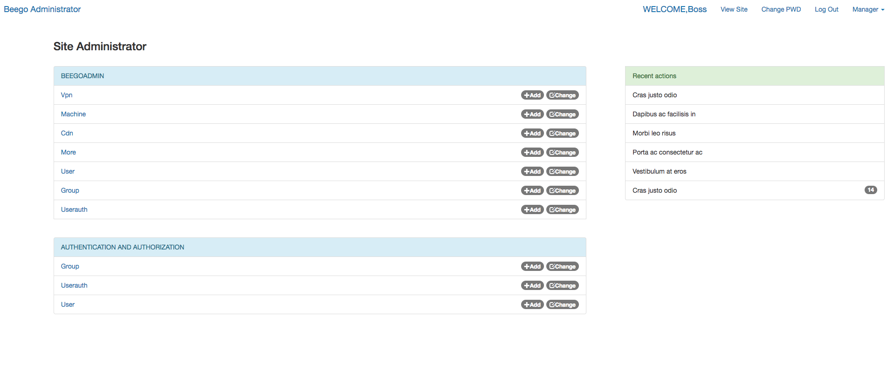

############
beegoadmin
############

.. contents:: 目录

介绍
====

beegoadmin 使用bootstrap3作为前端页面框架 模仿django admin界面进行数据的CRUD

功能模块
=======

- 主页面表展示

界面展示
-------

- 表数据查询

表数据查询
---------

- 表数据删除、添加、修改

数据增删改
---------

特点
====

- 自动注册model进行数据解析和界面动态生成

注册model代码::

package models

import (
	"time"
	. "github.com/lflxp/beegoadmin/models"
)

func init() {
	Register(new(Vpn), new(Cdn))
}

type Vpn struct {
	Id   int64  `xorm:"id notnull unique pk autoincr" name:"id"`
	Vpn  string `xorm:"vpn" name:"vpn" verbose_name:"Vpn字段测试" list:"true" search:"true"`
	Name string `xorm:"name" name:"name" verbose_name:"姓名" list:"true" search:"false"`
	Ip   string `xorm:"ip" name:"ip" verbose_name:"ip信息" list:"true" search:"false"`
}

type Cdn struct {
	Id           int64     `xorm:"id pk not null autoincr" name:"id" search:"true"`
	Num          int64     `xorm:"num" verbose_name:"数字" name:"num" colType:"int" list:"true" search:"true"`
	Cdn_name     string    `xorm:"cdn_name" name:"cdn_name" verbose_name:"cdn的名称" search:"true"`
	Type         string    `xorm:"type" name:"type" verbose_name:"类型" search:"false" colType:"textarea"`
	Detail       string    `xorm:"detail" name:"detail" verbose_name:"VPN信息" list:"false" search:"false" o2m:"vpn|id,vpn" colType:"o2m"`
	Radio        string    `xorm:"raidodas" name:"raidodas" verbose_name:"Radio单选" list:"true" search:"false" colType:"radio" radio:"男|man,女|girl,人妖|none"`
	Select       string    `xorm:"ss" name:"ss" verbose_name:"Select单选固定" list:"true" search:"false" colType:"select" select:"男11111111111111111111111111|man,女|girl,人妖|none"`
	MultiSelect  string    `xorm:"ss1" name:"ss1" verbose_name:"Multiselect多选" list:"true" search:"false" colType:"multiselect" multiselect:"男|man,女|girl,人妖|none,中|zhong,国|guo,人|ren,重|chong,Qing|qing"`
	MultiSelect2 string    `xorm:"ss2" name:"ss2" verbose_name:"Multiselect多选" list:"true" search:"false" colType:"multiselect" multiselect:"男|man,女|girl,人妖|none,中|zhong,国|guo,人|ren,重|chong,Qing|qing"`
	Files        string    `xorm:"file" name:"file" verbose_name:"cdn的名称" search:"true" colType:"file"`
	Times        time.Time `xorm:"times" name:"times" verbose_name:"时间" list:"true" search:"true"`
	Create       time.Time `xorm:"created"` //这个Field将在Insert时自动赋值为当前时间
	Update       time.Time `xorm:"updated"` //这个Field将在Insert或Update时自动赋值为当前时间
}

- 标记注释字段类型

models 标记tag
--------------

==============  ========  ===============================================================================
Tag             解释       标记
==============  ========  ===============================================================================
name            字段名    
verbose_name    昵称
list            显示字段
search          搜索
colType         字段类型
radio           单选       adio:"男|man,女|girl,人妖|none"
multiselect     多选       multiselect:"男|man,女|girl,人妖|none,中|zhong,国|guo,人|ren,重|chong,Qing|qing"
select          单选       select:"男|man,女|girl,人妖|none"
==============  ========  ===============================================================================

colType内容-> input[html]
-------------------------

============   ======  ========
Tag            解释     案例
============   ======  ========
string         字符串   text
int            数字     number
file           文件     Files
textarea       文本     textarea
radio          单选     radio
m2m            多对多    -
o2m            一对多    -
o2o            一对一    外键
time           时间      -
select         单选     select
multiselect    多选     -
password       密码     password
============   ======  ========

- 提供常用input数据类型
- 支持数据库一对一、一对多、多对多的数据展示和存储

待开发
=====

- 用户登录
- 用户管理
- 权限管理
- 操作历史记录
